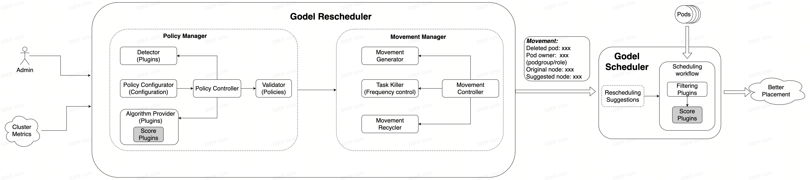

# Gödel Rescheduler

Schedulers in large-scale Kubernetes (K8s) clusters, such as the Godel Scheduler, are often required to schedule a large number of Pods within a short period. To meet service level objectives, such as minimizing job waiting times from users' perspectives, it is the scheduler's top priority to maximize scheduling throughput without compromising scheduling quality. In this context, the scheduler is often unable to make optimal scheduling decisions. Moreover, even if some scheduling placements are initially optimal, they are typically not sustainable over time as the cluster state continually changes. As a result, the production environment may suffer from issues like severe resource fragmentation, uneven node loads, and high inter-application communication costs due to suboptimal instance placements.

There were no pre-existing viable solutions for improving these suboptimal placements other than manual operations. Therefore, we introduced the Gödel Rescheduler to address these issues more effectively.

The objectives of Gödel Rescheduler are:

1. Define the rescheduling process to standardize interactions between the rescheduler and other components, such as the Gödel Scheduler.
2. Build a standardized rescheduling framework that ensures extensibility, ease of integration with new rescheduling strategies, and support for additional rescheduling scenarios.
3. Develop robust error-handling and migration constraint mechanisms to maintain cluster stability.

## Overall Architecture



**Policy Manager**
- Policy Configurator: Reads from the `ReschedulerPolicy Config Yaml` file to configure detectors, algorithms, triggers, and other necessary settings.
- Detector: Identifies nodes and Pods that meet migration criteria, with options to set a maximum limit on the number of nodes and Pods to migrate. The migration scope can be configured as either local (specific nodes or node level) or global.
- Algorithm Provider: Reassigns Pods identified by the detector using the specified placement algorithm.
- Validator: Checks and validates the placement results generated by the Algorithm Provider.
- Policy Controller: Manages the overall workflow of the Policy Manager, utilizing the capabilities of related modules to produce globally or locally optimal placement results.

**Movement Manager**
- Movement Generator: Based on PDB and other restrictions, the Movement Generator partitions the recommended placement results from the Policy Manager into multiple migration batches, organizing them as Movement objects.
- Task Killer: Deletes corresponding Pods based on migration decisions.
- Movement Recycler: Periodically cleans up migration decisions (Movement); the trigger conditions for cleanup are customizable.
- Movement Controller: Manages the overall workflow of the movement Manager.

**Gödel Scheduler**
- Receives Movement objects created by the Movement Manager, giving priority to the recommended nodes in Movement when scheduling the same type of Pod.

## Quick Start

### 1. Set Up the Local Gödel Scheduler Environment

#### Prepare the Gödel Cluster

Refer to: [Local Gödel Environment Setup with KIND](https://github.com/kubewharf/godel-scheduler/blob/main/docs/features/kind-cluster-setup.md), ensuring it includes commit [2309f09a9f38b9da7acbe99085445120c0c64a4e](https://github.com/kubewharf/godel-scheduler/commit/2309f09a9f38b9da7acbe99085445120c0c64a4e).

#### Switch kubectl Context

``` Bash
$ kubectl config use-context kind-godel-demo-default
```

#### Enable Rescheduling for Gödel Components: dispatcher, scheduler and binder

- If the components do not have the feature-gates flag (the default case):

``` Bash
$ kubectl patch deployment dispatcher scheduler binder -n godel-system --type=json -p '[{"op":"add","path":"/spec/template/spec/containers/0/args/-","value":"--feature-gates"},{"op":"add","path":"/spec/template/spec/containers/0/args/-","value":"SupportRescheduling=true"}]'
```

- If feature-gates flag are already there, manually edit the deployment YAML to enable the rescheduling feature-gates. For example, with dispatcher:
``` Bash
$ kubectl edit deployment dispatcher -n godel-system
```

```yaml
spec:
  template:
    spec:
      containers:
      - args:
        # other arguments...
        - --feature-gates
        - SupportRescheduling=true
```

### 2. Deploy Gödel Rescheduler

#### clone gödel scheduler repo to your machine

``` Bash
$ git clone https://github.com/kubewharf/godel-rescheduler
```

#### Change to the gödel rescheduler directory & build rescheduler image

```Bash
$ cd godel-rescheduler && make docker-images
```

#### Load rescheduler image to kind cluster

```Bash
$ kind load docker-image godel-rescheduler:latest --name godel-demo-default --nodes godel-demo-default-control-plane
```

#### Install rescheduler component

```Bash
$ kubectl apply -k manifests/base
```

### 3. BinPacking Rescheduling Example

We will demonstrate the rescheduling process using the BinPacking strategy, which consolidates Pods as much as possible. Specifically, the BinPacking strategy identifies nodes with low resource utilization and attempts to move Pods from these nodes to those with the highest resource utilization. In the previous deployment step, we have enabled the following BinPacking rescheduling strategy in the configuration file.

```yaml
    apiVersion: godelrescheduler.config.kubewharf.io/__internal
    kind: GodelReschedulerConfiguration
    profile:
      reschedulerPolicyConfigs:
      - policyTrigger:
          period: 5m
          signal: 12
        detector:
          name: BinPacking
          args:
            resourceItems:
            - resource: cpu
              weight: 1
            thresholdPercentage: 0.5
          detectorTrigger:
            signal: 12
        algorithm:
          name: BinPacking
        failureRatioThreshold: 0.3
```

This file configures the BinPacking detector and algorithm plugins and declares that the policy check can be triggered periodically or by signal 12. Additionally, the detector plugin defines some necessary parameters for the policy; the configuration above indicates that Pods on nodes with a CPU utilization of 0.5 or lower will be rescheduled.

#### Submit a Sample Workload

```Bash
$ kubectl apply -f docs/examples/binpacking/workload.yaml 

$ kubectl get pod -o wide                                          
NAME                                READY   STATUS    RESTARTS   AGE   IP           NODE                        NOMINATED NODE   READINESS GATES
nginx-deployment-856557487b-92qvn   1/1     Running   0          3s    10.244.1.8   godel-demo-default-worker   <none>           <none>
nginx-deployment-856557487b-kgv7f   1/1     Running   0          3s    10.244.1.9   godel-demo-default-worker   <none>           <none>
```

#### Untaint godel-demo-default-control-plane Node

```Bash
$ kubectl taint node godel-demo-default-control-plane node-role.kubernetes.io/master:NoSchedule-
```

#### Manually Trigger Rescheduling

```Bash
$ kubectl get node               
NAME                                STATUS   ROLES           AGE   VERSION
godel-demo-default-control-plane   Ready    control-plane   17h   v1.24.6
godel-demo-default-worker          Ready    <none>          17h   v1.24.6

$ docker exec -it godel-demo-default-control-plane bash   
root@godel-demo-default-control-plane:/# ps -ef | grep rescheduler
root        8319    8268  0 04:58 ?        00:00:44 /usr/bin/qemu-x86_64 /usr/local/bin/godel-rescheduler /usr/local/bin/godel-rescheduler --leader-elect=false --v=4 --port=0 --secure-port=12259 --dry-run=false --scheduler-config=/scheduler_config/scheduler.config --rescheduler-config=/rescheduler_config/rescheduler.config
root       11095   11080  0 06:47 pts/2    00:00:00 grep --color=auto rescheduler

root@godel-demo-default-control-plane:/# kill -12 8319
```

#### Observe Rescheduling Results

```Bash
$ kubectl get pod -o wide
NAME                                READY   STATUS    RESTARTS   AGE   IP            NODE                               NOMINATED NODE   READINESS GATES
nginx-deployment-856557487b-92qvn   1/1     Running   0          10s   10.244.0.16   godel-demo-default-control-plane   <none>           <none>
nginx-deployment-856557487b-kgv7f   1/1     Running   0          10s   10.244.0.15   godel-demo-default-control-plane   <none>           <none>

$ kubectl get movement -o yaml                           
apiVersion: v1
items:
- apiVersion: scheduling.godel.kubewharf.io/v1alpha1
  kind: Movement
  metadata:
    creationTimestamp: "2024-10-18T09:03:09Z"
    generation: 1
    name: movement-6b976b4bd9
    resourceVersion: "171087"
    uid: fd7842ed-9635-4043-9692-039c652d5f56
  spec:
    creator: BinPacking
    deletedTasks:
    - name: nginx-deployment-856557487b-lkkj5
      namespace: default
      node: godel-demo-default-worker
      uid: d284c27a-6455-402d-a93b-295ce57502eb
    - name: nginx-deployment-856557487b-4sdbx
      namespace: default
      node: godel-demo-default-worker
      uid: 826d8a88-2c9a-489b-812d-243cd5d60620
  status:
    notifiedSchedulers:
    - godel-scheduler
    owners:
    - owner:
        name: nginx-deployment-856557487b
        namespace: default
        type: ReplicaSet
        uid: 7c808a3b-5769-4096-ac02-304d94b7358b
      recommendedNodes:
      - actualPods:
        - name: nginx-deployment-856557487b-kgv7f
          namespace: default
          node: godel-demo-default-control-plane
          uid: b500cf14-85ef-4b3f-a15d-335890ab78fc
        - name: nginx-deployment-856557487b-92qvn
          namespace: default
          node: godel-demo-default-control-plane
          uid: 4e51b256-5d4e-4597-94fa-85f1dcc79f57
        desiredPodCount: 2
        node: godel-demo-default-control-plane
kind: List
metadata:
  resourceVersion: ""
  selfLink: ""
```
Two Pods have been moved to the node godel-demo-default-control-plane, as expected.

## Contribution Guide

Please refer to: [Contributing to Gödel Rescheduler](CONTRIBUTING.md)