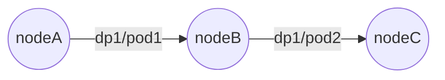
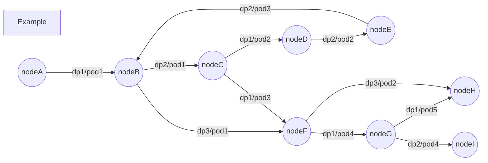
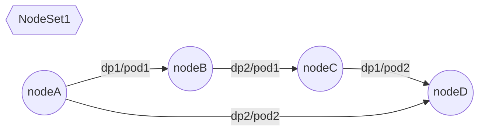
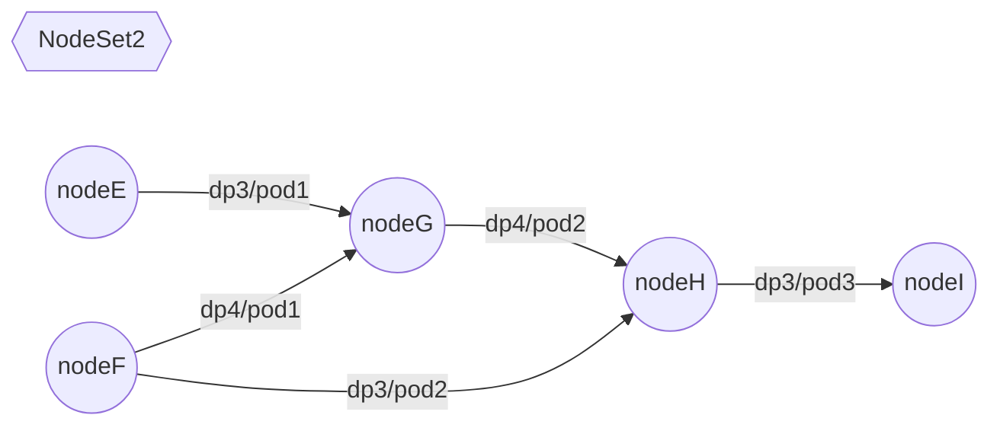

## Graph 0

```mermaid
flowchart LR
  nodeA((nodeA))
  nodeB((nodeB))
  nodeC((nodeC))
  nodeA-- dp1/pod1 -->nodeB
  nodeB-- dp1/pod2 -->nodeC
```

## Graph 1

```mermaid
flowchart LR
  title[Example]
	nodeA((nodeA))
	nodeB((nodeB))
	nodeC((nodeC))
	nodeD((nodeD))
	nodeE((nodeE))
	nodeF((nodeF))
	nodeG((nodeG))
	nodeH((nodeH))
	nodeI((nodeI))
	nodeA-- dp1/pod1 -->nodeB
	nodeB-- dp2/pod1 -->nodeC
	nodeC-- dp1/pod2 -->nodeD
	nodeD-- dp2/pod2 -->nodeE
	nodeE-- dp2/pod3 -->nodeB
	nodeB-- dp3/pod1 -->nodeF
	nodeC-- dp1/pod3 -->nodeF
	nodeF-- dp1/pod4 -->nodeG
	nodeG-- dp1/pod5 -->nodeH
	nodeF-- dp3/pod2 -->nodeH
	nodeG-- dp2/pod4 -->nodeI
```

## Graph 2

```mermaid
flowchart LR
  title{{NodeSet1}}
  nodeA((nodeA))
  nodeB((nodeB))
  nodeC((nodeC))
  nodeD((nodeD))
  nodeA-- dp1/pod1 -->nodeB
  nodeB-- dp2/pod1 -->nodeC
  nodeC-- dp1/pod2 -->nodeD
  nodeA-- dp2/pod2 -->nodeD
```

```mermaid
flowchart LR
  title{{NodeSet2}}
  nodeE((nodeE))
  nodeF((nodeF))
  nodeG((nodeG))
  nodeH((nodeH))
  nodeI((nodeI))
  nodeE-- dp3/pod1 -->nodeG
  nodeF-- dp4/pod1 -->nodeG
  nodeG-- dp4/pod2 -->nodeH
  nodeF-- dp3/pod2 -->nodeH
  nodeH-- dp3/pod3 -->nodeI
```